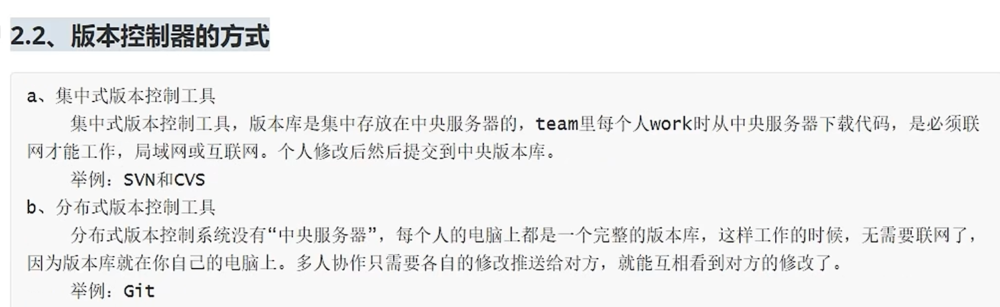
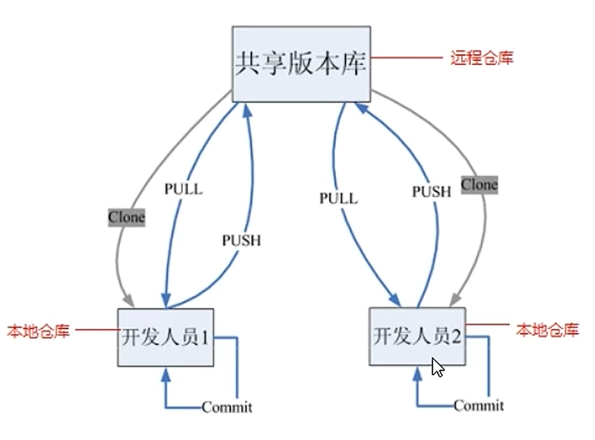

# 集中式版本控制工具
将所有人修改的代码统一放到一个中央服务器管理，每个人修改一次的代码都会成为新的版本号，但中央服务器断网或硬盘坏了会导致数据丢失，如svn，cvs。

# 分布式版本控制工具

没有中央服务器这个概念，每个人都是一个版本库，当修改代码后，可提交到共享版本库后，可以将版本库的内容拉下来给自己的电脑，这样每个人都是一个版本库，且任何两台设备之间都能够互推，这样即便共享版本库坏了，也能够在另一台电脑上拉版本库到自己的电脑上，也无需联网，如git。

# 作用
它们都能够上传代码到一个版本库，想要回退代码或者不同的人维护同一个代码时起到重要作用。