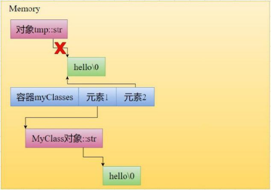

# 移动语义
## 基本认识
### 1. 移动语义是什么？
其实就是通过某种方法从一个对象的数据转移到另一个对象，从而减小拷贝开销，这种方式称为移动语义。

### 2. 为什么出现移动语义？
就是因为拷贝过程中如果数据量过大，那么开销过大，为了减小开销，就出现了移动语义。

## 移动语义的实现
### 1. 左值引用和右值引用
左值引用就是我们常用的引用，它的符号是”&”，可以引用变量名
  
而右值引用，是可以引用没有名称的临时对象以及被std::move标记的对象(也可以说是等号右边的值)，C++11引入右值引用就是为了配合移动语义的使用实现

示例代码如下：

    int val{ 0 };
    int&& rRef0{ getTempValue() };  // OK，引用临时对象
    int&& rRef1{ val };  // Error，不能引用左值
    int&& rRef2{ std::move(val) };  // OK，引用使用std::move标记的对象
以下两种情况会让编译器将对象作为右值进行引用  
1.一行代码执行完后就会销毁的临时对象，俗称匿名对象  
2.被std::move所转移的非const对象
  
让编译器将对象视为右值引用，是一切的基础

### 2. 区分拷贝和移动操作
拷贝操作和移动操作是不一样的，拷贝是申请一块新空间，然后将旧空间的数据复制到新空间去，而移动操作是将原来的空间交给另一个对象管理。  

举一个例子，示例代码如下：

    class MyClass
    {
    public:
        MyClass(const std::string& s)
            : str{ s }
        {};
        // 假设已经实现了移动语义
    private:
        std::string str;
    };
    std::vector<MyClass> myClasses;
    MyClass tmp{ "hello" };
    myClasses.push_back(tmp);  // 这里执行拷贝操作，将tmp中的数据拷贝给容器中的元素
    myClasses.push_back(std::move(tmp));  // 这里执行移动操作，容器中的元素直接将tmp的数据转移给自己
在这个例子中，我们有类和容器，将类对象插入至容器中，插入的时候进行两种不同的操作，一个是将原对象拷贝到容器中，一个是将原对象转移至容器中，这样有什么特点，元素1持有的是原对象的拷贝，而元素2持有的是原对象本身，我们可以发现，第二次插入时，开销变小，因为它不会执行申请空间和复制操作，开销减少了。
  

为什么会进行两种不同的操作？  
原因在于传递的值，我们把有名称和无名称的临时对象当作参数传递了过去，从而被编译器识别成了左值引用和右值引用，然后通过参数类型的不同触发push_back的重载函数，从而触发不同的操作。

    push_back重载函数伪代码如下
    class vector
    {
    public:
        void push_back(const MyClass& value)  // const MyClass& 左值引用
        {
            // 执行拷贝操作
        }

        void push_back(MyClass&& value)  // MyClass&& 右值引用
        {
            // 执行移动操作
        }
    };	
在这段伪代码中，我们发现一个是用左值引用触发，一个是通过右值引用触发，综上所述，通过传递左值引用和右值引用，就能触发不同重载版本的push_back，就能触发不同的操作。

### 3. 移动拷贝构造
C++11引入的新机制，移动拷贝构造，如果我们在创建对象时构造函数接收的是右值引用，那么就会触发移动拷贝构造 。 

示例代码如下：

    class MyClass{
    public:
    // 移动构造函数    
    MyClass(MyClass&& rValue) noexcept  // 关于noexcept我们稍后会介绍        
    : str{ std::move(rValue.str) }      // 看这里，调用std::string类型的移动构造函数 ，这里是将string类型转换成右值{}
        MyClass(const std::string& s)
            : str{ s }
        {}
    private:
        std::string str;};
假设我们自己写的类是官方的类，在这个类中，可以发现有一个构造函数，是以右值引用接收的。

    MyClass tmp{ "hello" };
    MyClass A{ std::move(tmp) };  // 调用移动构造函数，这里是将A对象转换成右值
为什么调用两次std::move？  
第一次是为了让编译器调用起MyClass类的移动构造函数而将A对象转换成右值，第二次是为了移动A对象里面的str对象，所以才调用第二次将str转换成右值并且触发移动拷贝构造，move转换后就会触发转换对象的移动构造。

然后创建两个对象，一个是tmp，一个是A，创建A时由于A的构造函数的参数是move返回的临时对象，因此被编译器识别为右值引用，因此触发移动拷贝构造，将tmp对象中的str转移到A中的str，从而减少了开销，std::move也有重载版本，如果传的左值引用，那么就会将左值转换成右值，如果传的是右值，那么会触发该类的移动拷贝函数。
  
**注意：std::movd只是将左值转换成右值引用，真正的移动操作是发生在各类成员的移动拷贝函数当中。**

### 4. 自己实现移动拷贝(移动语义)
    class MyClass
    {
    public:
        MyClass()
            : val{ 998 }
        {
            name = new char[5] {'P','e','t','e','r'};
        }
        //移动拷贝构造指的是将原有的对象数据转移到另一个对象中，原有对象数据需要清空，所以不能加const，以防修改不了
        MyClass(MyClass&& c) noexcept{      
            std::cout << "触发移动构造" << std::endl;
            this->val = c.val;
            this->name = c.name;
            c.val = 0;
            c.name = nullptr;
        }

        ~MyClass()
        {
            if (nullptr != name)
            {
                delete[] name;
                name = nullptr;
            }
        }
    private:
        int val;
        char* name;
    };
    int main()
    {
        MyClass A{};
        MyClass B{ std::move(A) };
        return 0;
    }

- 关于自己实现移动语义的问题
    1. 转移数据时，将基础类型变量比如int通过std::move移动到另一个变量时，会把临时地址转移到另一个对象中吗?  
    不会，由于基础变量对象是存储于栈空间，虽然有地址，但是没有内存管理的概念，那是属于堆区的概念，继而没有转移地址的概念，既然没有转移地址的概念，那就不会在转移数据时栈上将别的地址交给其他对象管理，在栈上所做的，只有开辟空间和赋值操作，所以通过std::move在栈上转移数据时，所做的只是赋值操作。

    2. 既然在栈上转移的基础类型的数据(比如int类型)是赋值操作，那使用std::move有意义吗?  
    答案是没有的，因为基础类型的数据是没有移动拷贝构造的，比如int，所以编译器会自动将move进行忽略，直接进行赋值操作，比如val{ std::move(rValue.val) }，这里的val是int类型变量，编译器会将move自动忽略，这里的代码相当于val{rValue.val}。

### 5. 移动赋值运算符(重载版本)
它是C++11引入的机制。  
它与拷贝构造和拷贝赋值运算符一样，可以接收右值引用，但它所做的事是通过等号的方式将对象中的数据转移到另一个对象中，跟移动拷贝一样，只不过触发的方式不同。

    class MyClass
    {
    public:
        MyClass()
            : val{ 998 }
        {
            name = new char[5] {'P','e','t','e','r'};
        }
        ~MyClass()
        {
            if (nullptr != name)
            {
                delete[] name;
                name = nullptr;
            }
        }
        void operator=(MyClass&& c) noexcept{
            std::cout << "触发重载移动赋值运算符" << std::endl;
            this->val = c.val;
            this->name = c.name;
            c.val = 0;
            c.name = nullptr;
        }
    private:
        int val;
        char* name;
    };
    int main()
    {
        MyClass A{};
        MyClass B{};
        B = std::move(A);
        return 0;
    }

## 移动构造函数和移动赋值运算符的生成规则
C++11之前有构造，析构，拷贝构造和拷贝赋值，而11后有移动拷贝和移动赋值。

### 1. deleted functions
在讲新加入的两个移动时，先讲已删除的函数，有一种语法，它可以使得某一个函数被删除，如果使用了该函数，则会报错，这种语法被称为“已删除的函数”(deleted functions)。  
    `语法：函数返回值 函数名(函数参数) = delete;`

    class MyClass{
    public:
    void Test() = delete;
    };
    MyClass value;
    value.Test();  // 编译错误：attempting to reference a deleted function

### 2. C++11的编译器会自动生成两个移动
我们知道C++11之前如果定义了一个空类，会为我们生成构造，析构，拷贝构造，拷贝赋值函数，而11及以后，还会编译器则还会生成移动拷贝和移动赋值。

    class MyClass{};
    MyClass A{};  // OK，执行编译器默认生成的构造函数
    MyClass B{ A };  // OK，执行编译器默认生成的拷贝构造函数
    MyClass C{ std::move(A) };  // OK，执行编译器默认生成的移动构造函数

### 3. 如果自定义了拷贝构造或拷贝赋值会发生什么事？
如果定义了一个空类，则会生成6个函数，即两个拷贝，两个移动，构造和析构，但当我自己定义两个拷贝中的一个，编译器则会禁止生成移动拷贝和移动赋值，如果此时接收了右值，会因为没有移动函数则转头执行拷贝操作。

    class Text 
    {
    public:
        Text() {
            std::cout << "触发构造" << std::endl;
        }

        Text(const Text& t) {
            std::cout << "触发拷贝构造" << std::endl;
        }
    };
    int main()
    {
        Text t;
        Text b{t};
        Text a{ std::move(t) };//由于编译器禁止了移动函数，虽然接收了右值，但仍会执行拷贝构造
        return 0;
    }

### 4. 如果自定义析构函数会发生什么事
如果自定义析构函数编译器则不会自动生成两个移动。

    class MyBaseClass
    {
    public:
        virtual ~MyBaseClass()
    {}
    };
    class MyClass : MyBaseClass  // 子类没有实现自己的析构函数{};
    MyClass A{};
    MyClass B{ std::move(A) };  // 这里将执行编译器自动生成的移动构造函数
如果没有virtual关键字，子类继承父类时编译器仍会自动生成移动拷贝和移动赋值，为什么？
加了virtual关键字，相当于子类要重写析构，析构自定义后，就无法自动生成了。
  
子类继承父类时，父类的析构要加virtual关键字，为什么？请看如下  
`Q.` 在C++中，子类继承父类时，父类的析构函数为什么要加virtual，在我的理解中，是因为子类可能有些内存没释放，需要父类调用子类的析构函数以释放，但父类无法调用，所以要加virtual，但是我不理解子类自己都可以调用析构，那为什么需要父类调用，加了virtual关键字后又有什么效果？
  
`A.` 这些问题发生在多态之中，当父类指针指向子类对象需要释放时，由于父类指针只看到自己那一部分，无法看到子类那部分内容，因为它是静态绑定，通过类型调用析构，所以只调用父类自己的析构，没有调用子类的析构函数，导致子类内存泄露，所以我们需要一种方法使父类看到子类析构并调用。  
当在父类加入virtual关键字后，父类会多个虚指针和虚函数表，子类继承下来时，不仅会将父类的属性行为继承下来，也会将虚指针和虚函数表继承下来，并要求子类重写含有virtual关键字的函数，当重写完毕之时，子类虚函数表中的父类函数地址会被替换为子类的虚函数地址，因此在释放时，由于析构函数被重写，delete能通过虚函数表找到子类的析构函数并调用，子类释放后父类也会自动释放。
  
总结：
静态绑定时delete只会通过类型调用析构函数，而动态绑定时则会查找虚函数表调用析构函数。

### 5. 移动构造函数和移动赋值运算符的相互影响
当自定义两个移动中的其中一个时，编译器不会自动生成另一个，如果使用没有自动生成的移动函数，则会直接进行报错，会被定义为使用“已删除的函数”。

    class MyClass
    {
    public:
        MyClass()
        {}

        // 我们定义了移动构造函数，这会禁止编译器自动生成移动赋值运算符，并且对移动赋值运算符的调用会产生编译错误
        MyClass(MyClass&& rValue) noexcept
        {}
    };
    MyClass A{};
    MyClass B{};
    B = std::move(A);  // 对移动赋值运算符的调用产生编译错误：attempting to reference a deleted function

### 6. 总结
当自定义拷贝构造，拷贝赋值，析构函数时，不会自定义生成两个移动，当执行移动操作时，会因为没有两个移动函数则会执行拷贝函数，当定义两个移动之间的一个，使用另一个没生成的会报错。

## noexcept
### 1. 为什么需要noexcept？
Push_back具有强异常保护(即当我们调用一个函数时，如果发生了异常，那么应用程序的状态能够回滚到函数调用之前)，在拷贝异常时，就会恢复原数据，根据这个概念，拷贝构造显然具有此特性，但移动函数在移动过程中会损坏原数据，无法恢复到调用之前的状态，因此只能在发生异常时，抛出异常，因此编译器一般情况下是不敢用移动拷贝的，只敢用拷贝构造，编译器觉得与其丢失原数据，不如不用，就导致性能下降，而我们希望性能提升，因此就可以加个noexcpet告诉编译器这个移动构造具有强异常保护，你放心大胆的用，所以编译器就会采用移动构造了。  

**所以加noexcpet就是告诉编译器大胆用移动构造，使得性能提升，这是在异常安全和性能之间的考量。**

如：

    class MyClass{
    public:
        MyClass()
        {}
        MyClass(const MyClass& lValue)
        {
            std::cout << "拷贝构造函数" << std::endl;
        }
        MyClass(MyClass&& rValue)  // 注意这里，我们没有对移动构造函数使用noexcept    {
            std::cout << "移动构造函数" << std::endl;
        }	
    private:
        std::string str{ "hello" };};

    MyClass A{};
    std::vector<MyClass> classes;
    classes.push_back(A);
    classes.push_back(A);
在这个例子中，A被push_back了两次，而默认的时候，classes容器元素为1，当push_back第二次时，由于空间不够，所以要去内存找一片新空间，并且将之前的数据拷贝过去，如果在第二次拷贝的过程中发生异常，那么可以通过原数据回到之前的状态(第一次push_back的状态)，但移动拷贝构造不行，会导致原有数据丢失的同时抛不出异常，回不到调用函数之前的状态，所以编译器不敢用移动拷贝，可以加个noexcpet让编译器更敢用noexcpet

加了noexcept后就会调用移动构造的形式将旧数据移到新空间当中

    #include<vector>
    class MyClass
    {
    public:
        MyClass()
        {}

        MyClass(const MyClass& lValue)
        {
            std::cout << "拷贝构造函数" << std::endl;
        }

        MyClass(MyClass&& rValue) noexcept  // 注意这里，为移动构造函数使用noexcept
        {
            std::cout << "移动构造函数" << std::endl;
        }

    private:
        std::string str{ "hello" };
    };
    int main()
    {
        MyClass A{};
        std::vector<MyClass> classes;
        classes.push_back(A);
        classes.push_back(A);
        return 0;
    }

当第二次调用push_back时，我发现调用了一次拷贝构造和一次移动构造，这是为什么？  
第二次调用push_back时，由于空间已满，所以要开辟一块新空间，然后把旧空间的数据挪到新空间中在插入新元素，开辟完空间后，由于A是左值，因此调用了拷贝构造将元素拷贝到第二个位置上，由于我加了noexcpet，编译器就认为旧数据复制到新空间时需要采用移动构造，因此将旧数据的搬到新空间时，采用的是移动构造，而旧数据只有一个，因此只触发了一次移动构造。

## 使用移动语义的需要注意的其他内容：
### 1. 编译器生成的移动构造和移动赋值额外知识
编译器生成的移动构造和移动赋值生成的是逐成员的移动语义，什么意思？意思就是你有几个成员变量，编译器就会生成几个移动语义  
比如：

    class MyClass
    {
    private:
        int val;
        std::string str;
    };
    编译器自动生成的移动拷贝和移动赋值如下：
    class MyClass
    {
    public:
        // 编译器自动生成的移动构造函数类似这样，执行逐成员的移动语义
        MyClass(MyClass&& rValue) noexcept
            : val{ std::move(rValue.val) }
            , str{ std::move(rValue.str) }
        {}

        // 编译器自动生成的移动赋值运算符类似这样，执行逐成员的移动语义
        MyClass& operator=(MyClass&& rValue) noexcept
        {
            val = std::move(rValue.val);
            str = std::move(rValue.str);

            return *this;
        }

    private:
        int val;
        std::string str;
    };
在这个例子中，我们发现每个数学都有与之对应的移动语义

### 2. 被移动的对象指针必须保证置空，这样才能保证正确释放
把被移动对象管理的资源移走后，被移动对象就称为“有效未定义”的状态  
>有效：被移动对象仍是一个合法对象，可以重新赋值，正常销毁  
>未定义：标准没有对被移动对象规定长什么样

所以当资源被转移后，被移动对象就成了“有效未定义”的有力体现，而如果转移后，被移动对象没有及时置空，就会导致移动对象和被移动对象指针都指向同一空间，就会导致释放两次从而程序崩溃，因此及时置空保证正确析构。

### 3. 避免非必要的std::move调用
由于现代C++编译器中启用名为”NRVO“技术特性存在，函数返回值时不需要手动调用std::move进行转换
- NRVO：named return value optimization（命名返回值优化）  

NRVO就是在返回一个具体名字的局部对象时，会将调用方预留的内存地址传过去，让函数直接将该地址当作返回的对象使用，这样能少一次拷贝构造

调用方的地址：
函数调用时，会为等号左边的对象(调用方)开辟一段内存地址，方便用于接收数据，这段地址被称为调用方的地址
比如：

    MyClass xmyClass = GetTemporary(); 
调用GetTemporary方法前，会提前为myClass 创建一片空间，而myClass 则被称为调用方，因此这片空间被称为调用方的地址

不启用NRVO时，如果返回一个临时对象，那么会进行两次操作，函数内构造一次局部对象，返回时拷贝一次给调用方

启用NRVO时，编译器会让函数签名多增加一个参数，这个参数是用来接收调用方的函数地址，调用时会直接将调用方预留内存的地址传到函数内，关于返回对象的操作都会在传过来的地址(调用方预留的内存)上操作
传过来的参数地址其实就是返回的对象，任何对该返回对象的操作都是在传过来的参数地址(调用方预留的内存)操作，相当于带回型参数，将地址传过去，让函数直接在这片地址进行操作
  
比如：

    class MyClass{};
    MyClass GetTemporary(){	
        MyClass A{};
    return A;
    }
    MyClass myClass = GetTemporary();  // 注意这里
调用GetTemporary函数时，编译器会为myClass对象提前开辟一段空间，用于接收返回的对象数据，编译器检测到返回的是一个具体名字的局部对象，因此它将函数签名改为

    void GetTemporary(void* __result);  // 伪代码
这样，就是多增加了一个参数，调用时编译器会自动将调用方预留内存地址(也就是&myClass)传到GetTemporary函数内，使得调用方对象取代A对象，在函数中，A其实就是myClass对象，对A的构造操作等同于对myClass的构造操作

## 参考链接
[一文入魂：妈妈再也不担心我不懂C++移动语义了](https://zhuanlan.zhihu.com/p/455848360)
