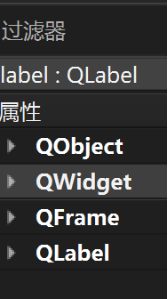
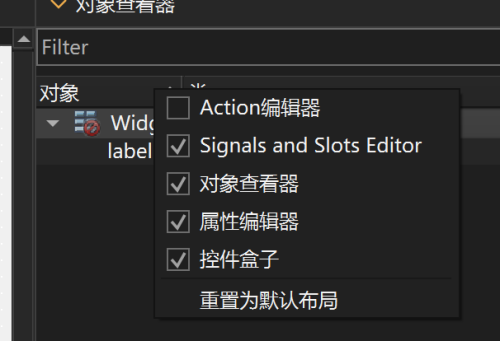
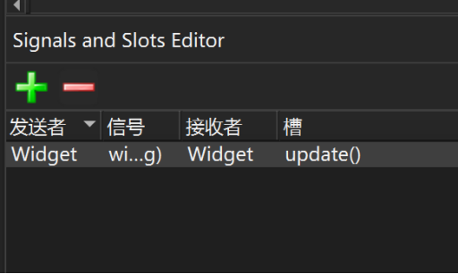

# 项目配置文件
在项目配置文件中，有qmake构建工具，Qt变量，UI文件，main文件等等，下面进行一些简单的介绍。
## qmake构建系统
qmake是构建工具，它的作用是根据项目配置文件生成makefile文件，然后编译器就可以根据makefile进行编译和连接，对于Qt项目，还会为元对象编译器和用户界面编译器生成构建规则。

## qmake 配置文件中常见变量的含义
在pro文件中，如果单词是大写的，那么往往意味着这是Qt的变量。
| 变量        | 含义                                                                                 |
|-------------|--------------------------------------------------------------------------------------|
| QT          | 项目中使用的 Qt 模块列表，在用到某些模块时需要手动添加                               |
| CONFIG      | 项目的通用配置选项                                                                   |
| DEFINES     | 项目中的预处理定义列表，例如可以定义一些用于预处理的宏                               |
| TEMPLATE    | 项目使用的模板，项目模板可以是应用程序（app）或库（lib）。如果不设置就默认为应用程序 |
| HEADERS     | 项目中的头文件（.h 文件）列表                                                        |
| SOURCES     | 项目中的源程序文件（.cpp 文件）列表                                                  |
| FORMS       | 项目中的 UI 文件（.ui 文件）列表                                                     |
| RESOURCES   | 项目中的资源文件（.qrc 文件）列表                                                    |
| TARGET      | 项目构建后生成的应用程序的可执行文件名称，默认与项目名称相同                         |
| DESTDIR     | 目标可执行文件的存放路径                                                             |
| INCLUDEPATH | 项目用到的其他头文件的搜索路径列表                                                   |
| DEPENDPATH  | 项目其他依赖文件（如源程序文件）的搜索路径列表                                       |

在这些变量中，有几个变量是用来管理项目包含的文件和路径的，比如HEADERS，SOURCES，RESOURCES，INCLUDEPATH等。

##  Qt变量讲解
QT变量是定义(包含)Qt项目所用到的Qt模块，如果你想往你的项目中加一些附加模块，就可以将附加模块添加到QT变量中，比如我想加SQL模块，那么就在pro文件写QT += sql。

##  qmake替换函数
qmake提供了一种替换函数，它用来将变量值替换到当前位置以用于在配置过程中处理该值，而$$是替换函数的前缀，比如$${TARGET}，它就是一个替换函数，表示将TARGET变量值替换到当前位置处理，完整语句是这样的。

    qnx: target.path = /tmp/$${TARGET}/bin
整句话的作用就是拼接成可执行文件的路径，如果想了解更多关于qmake细节知识，就可以查看Qt帮助文档中的qmake Manual主题。

## UI文件
我们通常把**设计阶段的UI称为窗体（Form），运行阶段的UI称为窗口**

在UI文件中放了个label控件，我们可以在属性编辑器中看到继承关系是从下往上的
QLabel -> QFrame -> QWidget - QObejct

可以在对象查看器选择信号编辑器快速完成信号槽连接

## main文件
int main(int argc, char *argv[])
{
    //应用程序对象是运行在操作系统的必要条件，窗口是附着在应用程序对象运行的
    QApplication a(argc, argv);         //创建应用程序对象
    Widget w;                       //创建窗口对象
    w.show();                       //窗口显示
    return a.exec();                   //开启消息循环和事件处理
}
QApplication是标准应用程序类，通过创建应用程序和窗口对象来显示界面 

# 窗口相关的文件的作用
窗口界面设计和界面组件的事件处理是GUI程序设计的主要任务，那么
1. UI可视化结果是如何转换成代码的
2. 窗口事件是如何与处理程序关联起来的
根据这两个问题我们现在解答：
首先我们在项目构建中取消Shadow build，然后以realease的方式构建，我们就会发现项目根目录下生成了一个ui_widget.h，至于这个文件有什么用，待会再说。
而与窗口相关的文件有4个，分别是：

| 文件         |    作用                                                     |
|-------------|-------------------------------------------------------------|
| Widget.h    |定义了窗口类|
| Widget.cpp  | 实现widget类功能的源程序文件|
| Widget.ui   | 窗口UI文件，用于在QtDesigner中进行UI可视化设计。它是一个XML文件，用，来存储界面上各个组件的属性和布局内容的|
| Ui_widget.h | 经过UIC编译后的UI文件，这里面定义了一个类叫Ui_widget，这里是用C++语言来描述界面组件的属性布局，信号槽等关联内容的文件|

1. widget.h  
    在widget.h中，有几个重要部分  
    **第一部分：**

        QT_BEGIN_NAMESPACE
        namespace Ui {
        class Widget;
        }
        QT_END_NAMESPACE

    该代码声明了一个名称为UI命名空间，该空间包含名为class Widget的类，但这个类并不是widget.h中所声明的类，而是在ui_widget.h，在中的ui_widget这个类，也就是用来描述界面属性和布局的类，但名字都不同，那为什么是这个类，是因为在ui_widget.h中，它把ui_widget继承下来，重新命名为widget。  
    如：

            namespace Ui {
                class Widget: public Ui_Widget {};
            } // namespace Ui
            所以widget.h中UI命名空间包含的widget是ui_widget.h文件继承下来的子类。

    **第二部分：**

            class Widget : public QWidget
            {
                Q_OBJECT
            public:
                Widget(QWidget *parent = nullptr);
                ~Widget();

            private:
                Ui::Widget *ui;
            };
    第一行插入的是名叫 Q_OBJECT宏，这个宏是使用元对象系统必需的宏，有了它，可以使用信号槽，属性等功能，而在最后一行中有个ui指针，它是用前面命名空间中的类所创建的一个指针对象，可通过该对象找到ui_widget.h中所定义的控件对象，也就是说利用命名控件将ui_widget类导入到widget.h头文件，然后为该类创建指针对象就可以找到ui_widget所持有的控件对象。

2. widget.cpp  
在widget.cpp中，完整代码如下:

        #include "widget.h"
        #include "ui_widget.h"
        Widget::Widget(QWidget *parent)
            : QWidget(parent)
            , ui(new Ui::Widget)
        {
            ui->setupUi(this);
        }

        Widget::~Widget()
        {
            delete ui;
        }
    在这些代码中
    - #include "ui_widget.h"  
        表示 包含经UIC编译的widget.ui后生成文件，方便创建窗口对象。
    - 构造函数

            Widget::Widget(QWidget *parent)
                : QWidget(parent)   
                , ui(new Ui::Widget)
        这些代码的作用就是运行构造函数然后将创建的ui::widget赋予头文件的ui指针。
    - ui->setupUi(this);  
        它的作用是将this（窗口实例对象）指针作为参数传到setupUi中，然后它就会在该窗口对象指针上创建控件并初始化，在widget.ui中，它是一个xml文件，它存储了界面上所有控件的属性布局，信号槽等关联的内容。

3. ui_widget.h
    1. 里面定义了一个ui_widget类，用于封装可视化设计界面的类，它没有父类，没有从QWidget继承下来，所以它不是一个窗口类。
    2. 在该类的public部分会为每个组件定义一个指针，指针的名称就是你设置的对象名。
    3. setup函数中用C++描述各组件的属性，布局等关联内容，其中retranslateUi是设置组件的文字属性方法。
    4. namespace Ui

            namespace Ui {
                class Widget: public Ui_Widget {};
            } // namespace Ui
        这里定义了一个UI命名空间，并在里面声明一个由ui_widget类继承下来的widget类，这样在widget.h中就能引入该类，虽然跟widget窗口类同名，但是能用命名空间区分谁是窗口类谁不是。	
    5. 回过头来看，widget.ui经过UIC编译后生成ui_widget.h，通过widget.h引入的ui_widget的子类，然后在widget.cpp中创建该实例，调用setupUi初始化界面，这就是窗口创建与初始化过程。

# 参考书籍
[Qt 6 C++开发指南](https://baike.baidu.com/item/Qt%206%20C%2B%2B%E5%BC%80%E5%8F%91%E6%8C%87%E5%8D%97/63406205)